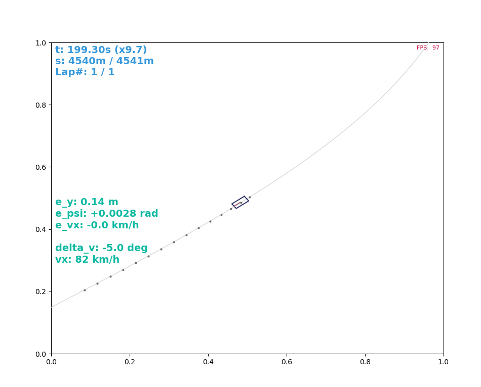
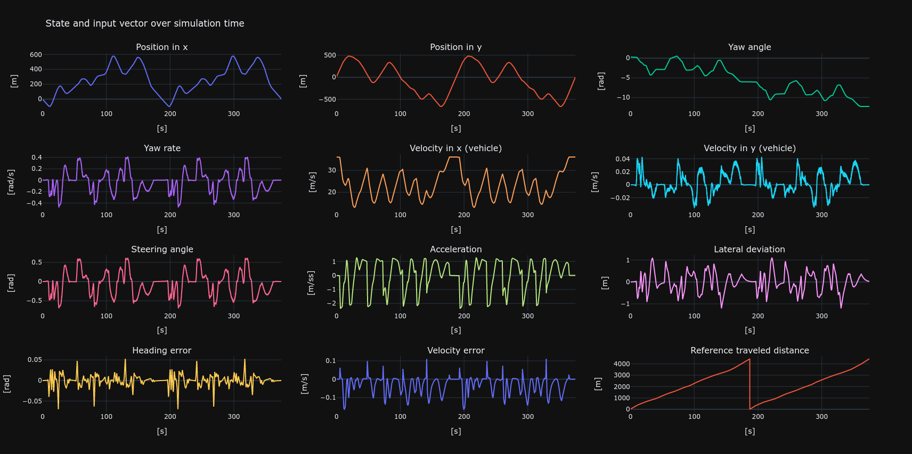
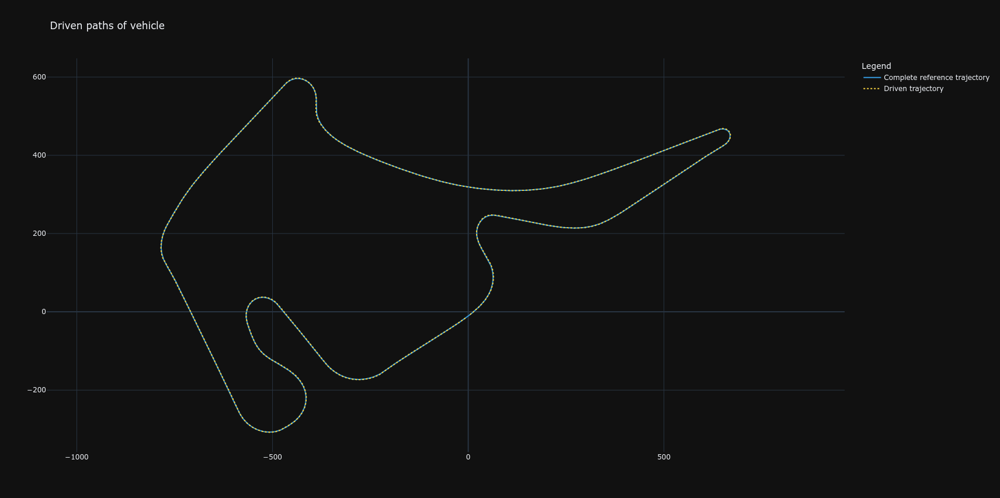

# Vehicle Motion Control Framework


Development framework for **vehicle motion control**. This repository provides a simple framework to develop and evaluate controller for trajectory tracking.
<!-- 
### Features

1. Animation



2. Evaluation plots

<p float="center">
    
    
</p>

### Examples

1. Trajectory tracking via PID-Controller

2. Trajectory tracking via Model Predictive Controller (MPC) -->

## Installation

```bash
git clone https://github.com/tonigineer/VehicleMotionControl.git
cd VehicleMotionControl
pip install -e .
pip install -r requirements.txt
```


<!-- ## Reference description

TODO: Trajectory description

## Models

TODO: Vehicle model -->

## Controller

<!-- 1. TrajTrackPID

A simple PID Controller with feed forward to track a reference trajectory.

Property | Comment
--- | ---
ControlOutput | `steering angle` $\delta_v$ and `acceleration command` $a_x$
Errors | `lateral deviation` $\epsilon_y$, `yaw error` $\epsilon_{\psi}$ and `velocity difference` $\epsilon_{vx}$
Feed forward | `curvature` for steering angle -->

```bash
python examples/trajectory_tracking_pid.py
```
<!-- 
2. TODO: MPC -->